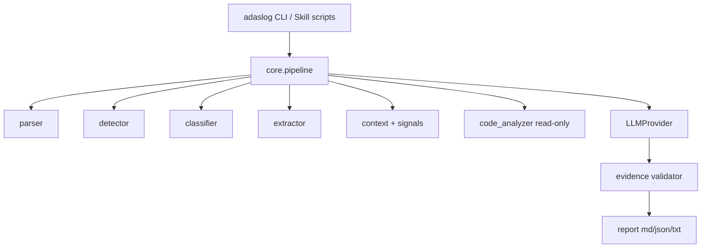

# Design

## 系统架构



## 模块划分

| 模块 | 职责 |
|---|---|
| `parser` | 编码、行解析、堆栈、TAG/pid |
| `detector` | JSON 规则包 → Anomaly |
| `classifier` | 加权 IssueType + 信号空闲规则 |
| `extractor` | 真正影响定位的关键行 |
| `context.signals` | `notifyCallback` 字段时间线 + DrivingTextManager idle/trigger |
| `analyzer` | 只读源码命中；规则根因 |
| `llm` | `LLMProvider` ABC；rule / openai / anthropic |
| `report` | 11 节报告 |
| `testing` | 黄金用例 + 指标 |

## 数据结构

见 `src/adaslog/models/__init__.py`：`LogEvent`, `Anomaly`, `Evidence`, `Classification`, `SignalPeriod`, `RootCauseCandidate`, `AnalysisReport`。

## Pipeline

`run_analysis()` 串联上述阶段。`issue_type==NORMAL` 时跳过 LLM。远端失败回退 rule。

## LLM Workflow

Prompt 只接收带 id 的 evidence bundle。输出 JSON candidates。Validator 丢掉未知 id 或无证据断言。

切换方式（不改代码）：

```
.env          LLM_PROVIDER=openai
              OPENAI_API_KEY=...
              OPENAI_BASE_URL=https://api.deepseek.com/v1
adaslog analyze x.log --llm openai
```

## Evidence First

Fact / Evidence / Hypothesis / Recommendation / Unknown。Hypothesis 必须引用 E1…。

## Skill Architecture

Progressive loading：`SKILL.md` → `references/` → `scripts/`（调用同一 package）。

## Error Handling

`LogLoadError` / `RuleLoadError` / `LLMProviderError`。CLI 默认打印短错误；`ADASLOG_DEBUG=1` 打栈。

## Testing Architecture

`tests/unit`（pytest）+ `tests/cases/{positive,negative}` + `adaslog run-tests` → `tests/results`.
