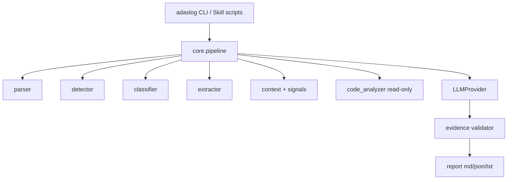

# Design

## 系统架构



## 模块划分

| 模块 | 职责 |
|---|---|
| `parser` | 编码、行解析、堆栈、TAG/pid |
| `detector` | JSON 规则包 → Anomaly |
| `classifier` | 加权 IssueType + 信号空闲规则 |
| `extractor` | 真正影响定位的关键行 |
| `context.signals` | `notifyCallback` 字段时间线 + DrivingTextManager idle/trigger |
| `analyzer` | 只读源码命中；规则根因 |
| `llm` | `LLMProvider` ABC；rule / openai / anthropic |
| `report` | 11 节报告 |
| `testing` | 黄金用例 + 指标 |

## 数据结构

见 `src/adaslog/models/__init__.py`：`LogEvent`, `Anomaly`, `Evidence`, `Classification`, `SignalPeriod`, `RootCauseCandidate`, `AnalysisReport`。

## Pipeline

`run_analysis()` 串联上述阶段。空数据 `data_status=empty|filter_empty` → `UNKNOWN`，不判 `NORMAL`。`issue_type==NORMAL` 时跳过 LLM。仅捕获 `LLMProviderError` 并回退 rule。日志文本作为数据放入 prompt，不当指令。报告 `run_id` 写入文件名。

分类置信度与根因置信度分开：异常得分不能直接推出根因 HIGH。多故障按 pid + 类别 + 60s 间隔拆成 `incidents`，每个故障用自己的证据生成并校验根因，顶层主问题按 PRIORITY 在过阈值类型中选取。时序只表示「先于」。无时间窗为 `full_retain`；有时间窗/PID 为 `filter_early`。

## LLM Workflow

Prompt 只接收带 id 的 evidence bundle（标注为 LOG DATA）。输出 JSON candidates。Validator 校验结构/枚举、证据编号、证据类型、反证，以及自由文本是否仅为症状复述（不信任模型自报的 claim_type/source）。无法验证的具体根因 → UNKNOWN，并区分缺少支持与存在反证。适配器对 `unknowns`/`candidates`/choices 类型错误抛出 `LLMProviderError`。

切换方式（不改代码）：

```
.env          LLM_PROVIDER=openai
              OPENAI_API_KEY=...
              OPENAI_BASE_URL=https://api.deepseek.com/v1
adaslog analyze x.log --llm openai
```

## Evidence First

Fact / Evidence / Hypothesis / Recommendation / Unknown。Hypothesis 必须引用 E1…。

## Skill Architecture

Progressive loading：`SKILL.md` → `references/` → `scripts/`（调用同一 package）。

## Error Handling

`LogLoadError` / `RuleLoadError` / `LLMProviderError`。CLI 默认打印短错误；`ADASLOG_DEBUG=1` 打栈。

## Testing Architecture

`tests/unit`（pytest）+ `tests/cases/{positive,negative}` + `adaslog run-tests --results <dir>`。执行器检查 `forbidden_evidence_categories` 等约束。`metrics.hallucination_rate` = CANDIDATE 无证据编号，不是根因正确率。自定义 `--cases` 必须读该目录的 expected.json。

## Packaged resources

`adaslog.resources` via `importlib.resources`。开发模式（源码树）与 wheel 安装共用同一加载函数；可写输出目录永远是 cwd/reports。
