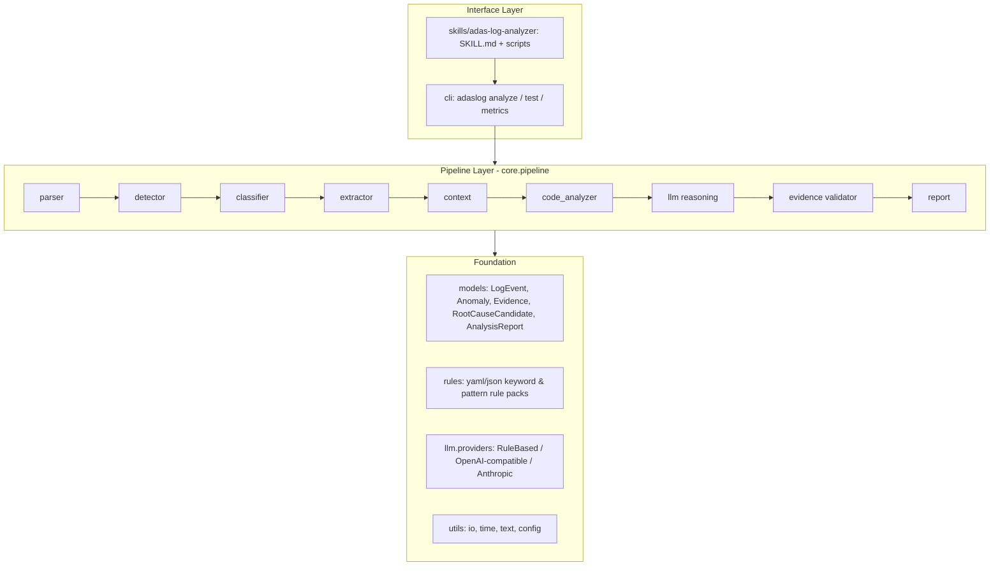
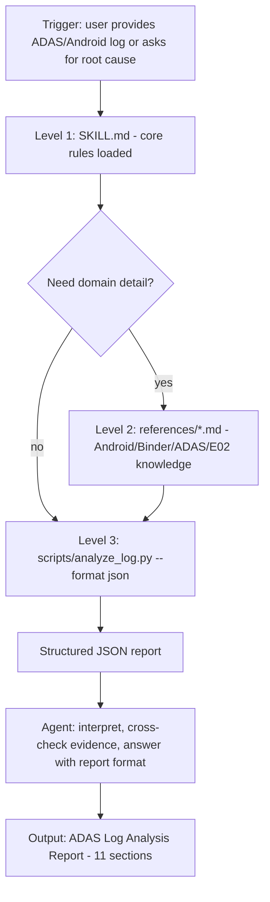

# Phase 1 – Project Assessment & Architecture Design

Project: **AI-Assisted ADAS Android Log Analysis and Root Cause Diagnosis Skill**
Root: `D:\carlogDeteor`
Date: 2026-09-30
Status: Phase 1 (analysis + design only, no business code generated)

---

## 【Project Assessment】

### 1. State of `D:\carlogDeteor`

| Item | Finding |
|---|---|
| Directory exists | Yes |
| Content | Only `.git/` (initialized 2026-09-29, branch `main`, **0 commits**, no remote) |
| Reusable files | None (no code, docs, or configs) |
| Action | Keep `.git/` as-is and build the project on top of it. Nothing to delete. |

### 2. Environment

| Item | Finding |
|---|---|
| OS | Windows 10/11 (win32 10.0.26200), PowerShell |
| Python | 3.13.14 (default), 3.11 also available via `py -3.11` |
| Git | 2.55.0.windows.3 |
| Sandbox | Shell commands require elevated (non-sandboxed) execution on this machine |

### 3. Target ADAS project analysed (read-only): `D:\E02_adas`

Constraint from the user: **E02_adas must not be modified**, and **no output may be written into it**. It is used only as an optional `--source` directory for code-context analysis.

Findings that directly shape the analyzer design:

| Aspect | Finding | Impact on design |
|---|---|---|
| Modules (Gradle) | `app`, `common_protocol`, `avmarbitration`, `driving_text_tip`, `adas_resources`, `avmcalibration`, `adas_account`, `adas_design`, `adas_debug` | Module map for `Related Modules` section |
| Root package | `com.chery.ivi.adas` with sub-packages `statemachine`, `avm`, `communication`, `service`, `manager`, `signal`, `uistate`, `cockpit`, `splitscreen`, `voice`, `memorynavigator`, `repository`, `viewmodel`, `receiver`, ... | Package → module mapping table in `references/` |
| Log wrapper | `AppLogger` prefixes every tag with `IVI_ADAS_APP_` and **truncates to 23 chars** (e.g. `IVI_ADAS_APP_StateMachi`) | Parser needs tag normalisation + prefix-based fuzzy mapping back to class names |
| Second wrapper | `LogUtil.logD/…` used widely (`common_protocol` uses `IVI_ADAS_` prefix) | Same normaliser handles both prefixes |
| Log language | Many messages are Chinese (e.g. `未定义的状态转换`, `VPD 状态下非法转换`) | Rule sets must be bilingual (zh + en) |
| State machine | `statemachine/StateMachine.kt`, `State.kt` (INIT, IDLE, PARK_READY, PARKING, …, VPA_*, VPD_*), `Event.kt` (ENTER_PARK_READY, EXIT_PARK, EXIT_VPA, …) | Known state/event vocab for `STATE_MACHINE` detection & illegal-transition recognition |
| Binder / AIDL | 10 AIDL files: `IAvmSdkService`, `IAvmSdkListener` (avmcalibration), `IDataService`, `ICallback` (Kanzi, common_protocol); 36 `RemoteException / onServiceDisconnected / binderDied` sites | Vocabulary for `BINDER_IPC` and `MODULE_COMMUNICATION` |
| Communication | Kanzi SDK, gRPC (`GrpcConnectionManager`), SOME/IP (`SomeIpAdapter`), VDBus, Navi SDK adapters | Communication-failure keyword sets |
| Source scale | 614 `.kt` + 9 `.java` files (excluding `build/`), 10 `.aidl` | Code analyzer must index Kotlin first; a file index (class → path) is built once per run |
| Product flavors | `app/src/{main,e0v,e0y,t13j,t18fl4}`, `driving_text_tip/src/{main,e0y}` | Stack-frame → file resolution must search `main` plus all flavor source sets; ambiguous hits are reported as multiple candidates, not guessed |
| Sample logs in repo | None | Test logs must be authored synthetically (modelled on real tags/states above) |

### 4. Reuse decision

Nothing in `D:\carlogDeteor` is reusable. Knowledge extracted from `E02_adas` (tags, states, events, packages, service names) will be captured as **reference data** in `skills/adas-log-analyzer/references/` – never as copied source code.

---

## 【Architecture】

### Principles

1. **Evidence First** – every conclusion carries `Fact / Evidence / Hypothesis / Recommendation / Unknown` labels; no root cause without evidence references.
2. **Offline-first, LLM-optional** – the full pipeline (parse → detect → classify → extract → context → report) runs deterministically without any API key. LLM reasoning is a pluggable enhancement behind `LLMProvider`.
3. **Read-only** – the tool never writes into source directories, never runs git, never modifies code.
4. **Progressive loading Skill** – `SKILL.md` (rules) → `references/` (knowledge) → `scripts/` (executables).
5. **Small steps** – each phase leaves the project runnable and tested.

### Layered view



### Technology stack

| Layer | Choice | Reason |
|---|---|---|
| Language | Python 3.11+ (dev on 3.13) | Prompt recommendation; both versions installed |
| CLI | `argparse` (stdlib) | Zero-dependency guarantee for MVP; Typer optional later |
| Data models | `dataclasses` + `typing` (stdlib); Pydantic optional | Keeps offline install trivial |
| Rules | YAML/JSON rule packs loaded at runtime | Editable by engineers without code changes |
| Output | Markdown / JSON / TXT | Required by spec |
| LLM | `LLMProvider` ABC; `RuleBasedProvider` (default, offline), `OpenAICompatibleProvider` (OpenAI / DeepSeek / Qwen via `OPENAI_BASE_URL`), `AnthropicProvider` | Replaceable; keys only from `.env` / env vars / config |
| Tests | `pytest` + custom case runner | Unit tests + golden case suite |
| Console | `rich` optional (graceful fallback) | Nicer terminal output when available |

---

## 【Directory Tree】

```text
D:\carlogDeteor
│
├── README.md
├── proposal.md
├── midterm.md
├── pyproject.toml                  # package metadata, console script `adaslog`
├── requirements.txt                # pytest (+ optional: rich, pyyaml, pydantic, openai, anthropic)
├── .env.example                    # LLM_PROVIDER, OPENAI_API_KEY, OPENAI_BASE_URL, ANTHROPIC_API_KEY
├── .gitignore
├── config/
│   ├── default.yaml                # context window, thresholds, output dir, source roots
│   └── rules/
│       ├── android_common.yaml     # FATAL EXCEPTION, ANR, tombstone, Caused by ...
│       ├── binder_ipc.yaml         # DeadObjectException, TransactionTooLarge, binderDied ...
│       ├── state_machine.yaml      # 未定义的状态转换 / 非法转换 / illegal transition / State names
│       ├── communication.yaml      # Kanzi / gRPC / SOME/IP / VDBus / Navi SDK failures
│       └── e02_modules.yaml        # tag-prefix rules, package→module map, known services
│
├── src/
│   └── adaslog/
│       ├── __init__.py
│       ├── cli/            main.py (analyze, run-tests, metrics, version)
│       ├── core/           pipeline.py, config.py, errors.py
│       ├── models/         events.py, anomaly.py, evidence.py, report.py (dataclasses)
│       ├── parser/         logcat.py (threadtime/time/brief/custom), stacktrace.py, tag_normalizer.py, loader.py
│       ├── detector/       anomaly_detector.py, rules_engine.py
│       ├── classifier/     issue_classifier.py (weighted rules → type + confidence + evidence)
│       ├── extractor/      key_log_extractor.py (first error / fatal / binder / timeout / ANR ...)
│       ├── context/        context_builder.py (time/pid/tid windows, causal chain)
│       ├── analyzer/       code_analyzer.py (stack → file → method, read-only), root_cause.py
│       ├── llm/            provider.py (ABC), rule_based.py, openai_compat.py, anthropic.py, prompts.py, validator.py
│       ├── report/         generator.py, markdown.py, json_out.py, text.py
│       └── utils/          io.py, timeparse.py, text.py, log.py
│
├── tests/
│   ├── unit/                       # pytest: parser, detector, classifier, extractor, report
│   ├── cases/
│   │   ├── positive/
│   │   │   ├── crash_case_01/          {input.log, expected.json}
│   │   │   ├── binder_case_01/
│   │   │   ├── exception_case_01/
│   │   │   ├── state_case_01/
│   │   │   └── communication_case_01/
│   │   └── negative/
│   │       ├── normal_case_01/
│   │       └── insufficient_evidence_01/
│   ├── fixtures/                   # small log snippets for unit tests
│   ├── runner/                     # case_runner.py, metrics.py
│   └── results/
│       ├── test_result.md
│       ├── test_result.json
│       └── metrics.json
│
├── docs/
│   ├── phase1_assessment.md        # this file
│   ├── design.md
│   └── report.md
│
├── skills/
│   └── adas-log-analyzer/
│       ├── SKILL.md
│       ├── scripts/
│       │   ├── analyze_log.py      # thin wrapper → adaslog.cli
│       │   ├── run_tests.py
│       │   ├── extract_evidence.py
│       │   └── format_report.py
│       └── references/
│           ├── android_log_rules.md
│           ├── binder_error_rules.md
│           ├── adas_log_knowledge.md     # E02 tags, states, events, services
│           ├── root_cause_rules.md
│           ├── confidence_rules.md
│           └── examples.md
│
├── skills-creator/
│   └── fix-log.md
│
├── examples/
│   └── sample_logs/ , sample_reports/
│
├── reports/                        # CLI default output dir for generated analysis reports
└── tmp/                            # temporary files only
```

All core directories/files required by the spec are present and unchanged; additions are only sub-directories or extra files.

---

## 【Module Responsibilities】

| Module | Responsibility | Freedom level |
|---|---|---|
| `parser.loader` | Read `.log/.txt` (UTF-8/GBK auto-detect), split into raw lines, keep line numbers | High |
| `parser.logcat` | Recognise logcat `threadtime`, `time`, `brief`, and custom `YYYY-MM-DD HH:MM:SS.mmm L/Tag:` formats; extract timestamp, level, pid, tid, tag, message; detect `--------- beginning of crash/main/system` markers | High |
| `parser.stacktrace` | Merge multi-line exceptions (`FATAL EXCEPTION`, `Process:/PID:`, `java.lang.X: msg`, `at …`, `Caused by:`, `... N more`, Kotlin coroutine frames), attach as `stacktrace[]` to the owning event | High |
| `parser.tag_normalizer` | Strip `IVI_ADAS_APP_` / `IVI_ADAS_` prefixes, resolve 23-char truncated tags against known class list, derive `module` from tag/package map | High |
| `detector` | Score each event against rule packs → `Anomaly(kind, severity, event_ref, matched_rule)`; kinds: FATAL, EXCEPTION, ANR, BINDER_FAIL, SERVICE_DISCONNECT, STATE_ILLEGAL, TIMEOUT, COMM_FAIL, KEY_WARNING | High |
| `classifier` | Aggregate anomalies → `IssueType` ∈ {CRASH, EXCEPTION, BINDER_IPC, STATE_MACHINE, MODULE_COMMUNICATION, SYSTEM_ERROR, BUSINESS_ERROR, NORMAL, UNKNOWN} with numeric confidence and evidence refs; NORMAL when no anomaly, UNKNOWN when anomalies match no pattern | High |
| `extractor` | Pick key logs: first error, first exception, fatal, crash, binder failure, service disconnect, state transition failure, timeout, ANR, key warnings; rank by significance, deduplicate repeats | High |
| `context` | Build windows (±N s / ±N lines, same pid/tid/tag) around key events; build ordered causal chain (`connection established → transaction failed → disconnected → retry failed`) | High |
| `analyzer.code_analyzer` | If `--source` given: map stack frames to `.kt/.java` files, extract method snippet, flag risk patterns (`!!`, unchecked nullable, `lateinit`, Binder call, Handler/Coroutine/StateFlow, callback), also scan `.xml` (manifest services) – **read-only** | Medium (Evidence+Reasoning+Confidence) |
| `analyzer.root_cause` | Produce `RootCauseCandidate[]` from anomalies + context + code hits; each with evidence refs, reasoning, confidence HIGH/MEDIUM/LOW, need-verification list; emit `UNKNOWN + Insufficient evidence` when thresholds not met | Medium |
| `llm.provider` | `LLMProvider` ABC (`reason(context) -> LLMResult`); `RuleBasedProvider` default; API providers read keys from env/.env/config only | Medium |
| `llm.validator` | Evidence Validator: every LLM-produced candidate must cite existing evidence IDs; uncited/unsupported claims are downgraded to Hypothesis or dropped; enforces NORMAL / UNKNOWN rules | Strict |
| `report` | 11-section report in Markdown / JSON / TXT; labels Fact / Evidence / Hypothesis / Recommendation / Unknown | High |
| `cli` | `adaslog analyze <log> [--source DIR] [--format md|json|txt] [--out DIR] [--llm rule|openai|anthropic]`, `adaslog run-tests`, `adaslog metrics` | – |
| `tests.runner` | Execute all cases, compare with `expected.json`, write `test_result.md/json`, compute metrics | – |
| Strict prohibitions (tool runtime) | No code modification, no git commit/push, no Gerrit, no auto-fix, no file deletion | Strict |

---

## 【Data Flow】

```mermaid
flowchart LR
    RAW[Raw .log/.txt] --> LD[loader] --> LP[logcat parser] --> ST[stacktrace merger] --> TN[tag normalizer]
    TN --> EV[(LogEvent[])]
    EV --> AD[anomaly detector] --> AN[(Anomaly[])]
    AN --> CL[classifier] --> IT[(IssueType + confidence)]
    AN --> KX[key log extractor] --> KE[(KeyEvidence[])]
    KE --> CB[context builder] --> CX[(ContextWindow + CausalChain)]
    CX --> CA[code analyzer - optional --source] --> CH[(CodeHit[])]
    IT & KE & CX & CH --> RC[root cause analyzer]
    RC --> LLM[LLMProvider.reason] --> VAL[evidence validator] --> RPT[(AnalysisReport)]
    RPT --> MD[report.md] & JS[report.json] & TX[report.txt]
```

Core data structures (dataclasses):

```text
LogEvent          {id, line_no, timestamp, level, pid, tid, tag, raw_tag, module, message, stacktrace[], raw}
Anomaly           {id, kind, severity, event_id, rule_id, matched_text, score}
Classification    {issue_type, confidence: float, evidence_ids[], alternatives[]}
KeyEvidence       {id, event_id, category, why_it_matters, rank}
ContextWindow     {anchor_event_id, before[], after[], causal_chain[]}
CodeHit           {file, line, method, snippet, risk_patterns[], evidence_ids[]}
RootCauseCandidate{title, confidence: HIGH|MEDIUM|LOW, evidence_ids[], reasoning, need_verification[], status: CANDIDATE|UNKNOWN}
AnalysisReport    {issue_type, severity, summary, key_evidence[], timeline[], root_causes[], confidence,
                   related_modules[], related_code[], recommendations[], unknowns[], meta}
```

---

## 【LLM Flow】

```mermaid
sequenceDiagram
    participant P as Pipeline
    participant PB as PromptBuilder
    participant LLM as LLMProvider
    participant V as EvidenceValidator
    participant R as Report
    P->>PB: Classification + KeyEvidence + Context + CodeHits (evidence IDs E1..En)
    PB->>LLM: system rules (Evidence First, allowed labels, JSON schema) + evidence bundle
    LLM-->>V: JSON {candidates[{title, confidence, evidence_ids, reasoning, need_verification}], unknowns[]}
    V->>V: check every evidence_id exists; drop/downgrade unsupported claims; enforce NORMAL/UNKNOWN rules
    V-->>R: validated RootCauseCandidate[] or UNKNOWN(Insufficient evidence)
```

Rules:

- Default provider is `RuleBasedProvider` (deterministic, offline). API providers are enabled only via `--llm openai|anthropic` or `LLM_PROVIDER` env var.
- Keys come from `.env` (loaded from project root), environment variables, or `config/default.yaml` placeholders – never hard-coded.
- LLM is asked to output strict JSON; parse failure → fallback to rule-based result, recorded in report `meta.llm_status`.
- Evidence Validator is mandatory regardless of provider; hallucination guard is not optional.
- If `issue_type == NORMAL` the LLM step is skipped entirely (no root cause section produced).

---

## 【Skill Flow】



Relationship between Skill and program:

- `SKILL.md` defines *how the agent must think* (Evidence First, labels, confidence, negative control, when not to use).
- `scripts/` are thin wrappers that call `src/adaslog` – the same code path as the CLI, so Skill behaviour and program behaviour cannot diverge.
- `references/` hold knowledge the agent loads on demand (E02 tag/state/service vocab, Binder error semantics, root-cause and confidence rules, worked examples).
- The agent must never claim a root cause that the JSON report lists as UNKNOWN unless it adds new, cited evidence.

---

## 【Testing Strategy】

| Level | Tool | Scope |
|---|---|---|
| Unit | pytest (`tests/unit`) | parser formats, stack merge, tag normaliser, each detector rule, classifier thresholds, extractor ranking, report rendering |
| Case (golden) | `tests/runner/case_runner.py` | 5 positive + 2 negative cases; each case = `input.log` + `expected.json` (issue_type, must-have key evidence, expected root-cause status, forbidden outputs) |
| Negative control | same runner, stricter asserts | `normal_case_01` → `NORMAL`, **no** root cause section; `insufficient_evidence_01` → `UNKNOWN`, confidence LOW, reason “Insufficient evidence”, no code-specific claims |
| Integration | CLI smoke | `adaslog analyze` on every case in all 3 formats; exit codes; `--source D:\E02_adas` read-only run (verify no write to source dir by hashing tree before/after) |
| Results | `tests/results/test_result.md|json` | Case, Expected, Actual, Pass/Fail, Evidence, Error |

Case design (synthetic logs modelled on real E02 tags/states/services):

| Case | Content | Expected |
|---|---|---|
| crash_case_01 | `FATAL EXCEPTION: main`, `Process: com.chery.ivi.adas`, NPE in `AvmViewPresenter` | CRASH, HIGH, stack frame evidence |
| binder_case_01 | `DeadObjectException` on `IAvmSdkService`, `onServiceDisconnected`, retry fails | BINDER_IPC, causal chain |
| exception_case_01 | Non-fatal `IllegalStateException` caught & logged by `AdasKanZiManager` | EXCEPTION, MEDIUM |
| state_case_01 | `IVI_ADAS_APP_StateMachi` `未定义的状态转换: 当前状态 IDLE -> 预触发 ENTER_PARKING` followed by `EXIT_PARK` | STATE_MACHINE |
| communication_case_01 | gRPC `UNAVAILABLE` / Kanzi `onServiceDisConnected` / timeout | MODULE_COMMUNICATION |
| normal_case_01 | service started / connection established / request completed | NORMAL, no root cause |
| insufficient_evidence_01 | single `E ... something happened`, no stack/context | UNKNOWN, LOW, Insufficient evidence |

---

## 【Metrics】

Computed by `tests/runner/metrics.py` → `tests/results/metrics.json` and summarised in `docs/report.md`:

| Metric | Definition |
|---|---|
| Classification Accuracy | correct issue_type / total cases |
| Precision / Recall / F1 (macro) | per issue_type over the case set |
| Key-log extraction Precision / Recall | extracted key events vs `expected.json.key_evidence` (line-number match) |
| Evidence Coverage | conclusions with ≥1 valid evidence ref / all conclusions |
| Hallucination Rate | conclusions asserting a specific root cause with 0 evidence refs / all conclusions (target 0) |
| Negative-control pass rate | normal + insufficient cases passing / 2 |
| Efficiency | manual analysis time (engineer estimate per case, recorded in `expected.json.manual_minutes`) vs measured tool wall-clock + review time |

Honesty rule: metrics computed on the 7 authored cases are reported as such; no claims of generalisation beyond the test set.

---

## 【MVP Plan】

Ordered phases (each ends with: run → test → fix → record in `fix-log.md` → git commit):

| Phase | Deliverable | Runnable check |
|---|---|---|
| 2 Skeleton | dirs, `pyproject.toml`, `README`, `proposal.md`, CLI `adaslog version`, models, config loader | `python -m adaslog version` |
| 3 Log Parser | loader, logcat formats, stack merge, tag normaliser, JSON dump of events | `adaslog parse x.log` |
| 4 Anomaly Detector | rule packs + detector | anomalies listed in output |
| 5 Classifier | issue type + confidence + evidence | classification printed |
| 6 Evidence Extractor + Context | key logs, windows, causal chain | evidence & timeline printed |
| 7 LLM Analyzer | `LLMProvider`, rule-based default, OpenAI-compat/Anthropic, validator, root-cause candidates | UNKNOWN handling verified |
| 8 Report Generator | 11-section md/json/txt | reports in `reports/` |
| 9 Test Cases | 5 positive + 2 negative + runner + results | `adaslog run-tests` |
| 10 Skill | SKILL.md, scripts, references | run via `scripts/analyze_log.py` |
| 11 Integration | `--source D:\E02_adas` code analyzer (read-only), end-to-end | full report with Related Code |
| 12 Evaluation | metrics, midterm.md update | `metrics.json` |
| 13 Final Report | `docs/report.md`, `docs/design.md` finalised, README aligned with real capabilities | acceptance checklist |

---

## 【5-Week Plan】

| Week | Phases | Output |
|---|---|---|
| 1 | 2–3 | Project init, structure, README, proposal, CLI, log loading & parsing |
| 2 | 4–6 | Anomaly detection, classification, key-log extraction, context correlation |
| 3 | 7–8 | LLM provider layer, Evidence First, root-cause candidates, confidence, structured report |
| 4 | 9–10 (+11 code analysis) | Source analysis, Skill, positive & negative cases, midterm.md (≥5 commits) |
| 5 | 12–13 | Metrics, performance tuning, final tests, docs/report.md, demo, fix-log |

---

## 【Risks】

| Risk | Impact | Mitigation |
|---|---|---|
| Tag truncation (`IVI_ADAS_APP_StateMachi`) breaks module mapping | Wrong `Related Modules` | Prefix-aware normaliser + known-class prefix matching from `e02_modules.yaml` |
| Bilingual logs (zh/en) | Missed rule matches | Every rule pack carries zh + en patterns; tests include Chinese messages |
| No real production logs available | Test set is synthetic | Model cases on real tags/states/services; clearly label as synthetic; request real logs (see inputs) |
| LLM hallucination | Violates Evidence First | Mandatory Evidence Validator; rule-based default; NORMAL skips LLM; hallucination rate metric |
| LLM API unavailable / no key | Pipeline blocked | Offline rule-based provider is default; API is opt-in |
| Large log files (hundreds of MB) | Memory/time | Streaming line parser, pre-filter by level, configurable context windows |
| Reading `D:\E02_adas` accidentally writes there | Violates user constraint | Code analyzer opens files read-only; integration test hashes source tree before/after |
| Sandbox restrictions on this machine | Commands need elevated permission | All runs use non-sandboxed shell; outputs remain under `D:\carlogDeteor` |
| Scope creep (RAG, multi-agent) | MVP delayed | RAG/Harness deferred to after Phase 13; documented as Planned |

---

## 【Required Inputs】

1. **Real E02 log samples** (logcat exports, crash/ANR/Binder/state-machine cases) – optional but strongly improves test realism. If not provided, synthetic cases will be used and labelled as such.
2. **LLM provider preference and credentials** (OpenAI-compatible endpoint such as DeepSeek/Qwen, or Anthropic) supplied via `.env` – optional; MVP runs offline without them.
3. **Confirmation of Python version** – plan is Python 3.11+ (developed on 3.13).
4. **Confirmation that git commits inside `D:\carlogDeteor` are permitted** for project development history (required by midterm ≥5 commits). The analyzer tool itself will never run git.
5. **Manual analysis time baseline** – rough minutes an engineer needs per case type, for the Manual-vs-AI efficiency metric (defaults will be estimated and marked as estimates if not provided).
6. **Any additional issue types** beyond the 9 required (e.g. `ANR`, `PERFORMANCE`) you want as first-class categories.
